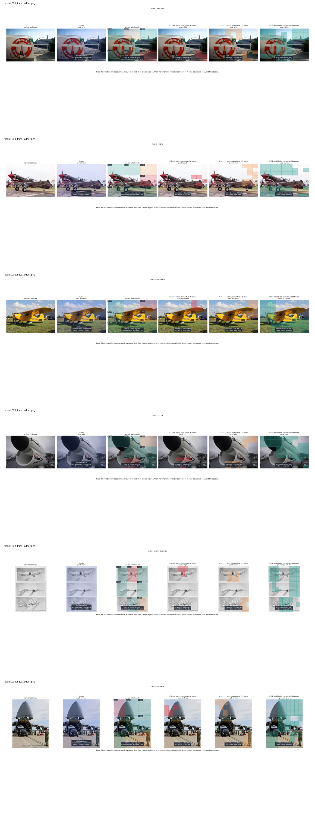
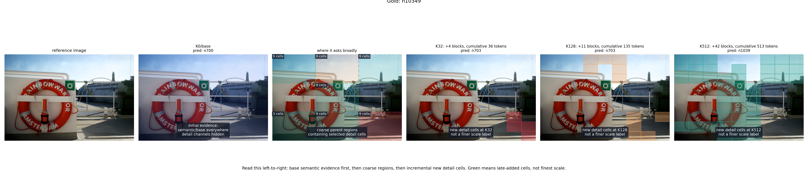
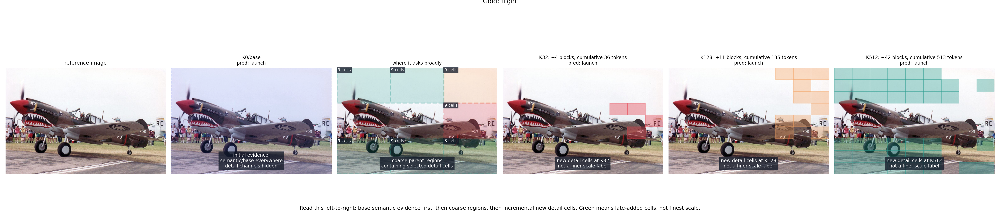
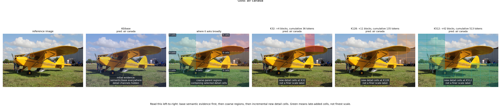
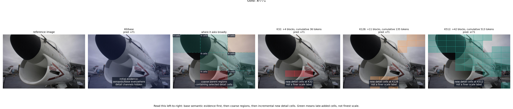
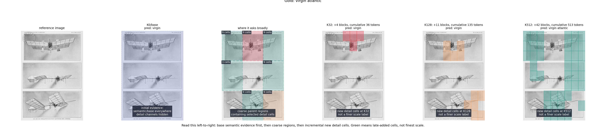
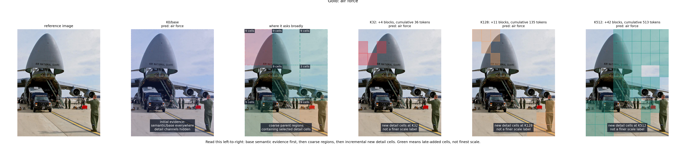

# tokenflow

Question-conditioned visual evidence selection on the released TokenFlow VQA grid.

```text
image + question
-> ByteVisionLab/Tokenflow-llava-qwen2.5-14B-finetuning
-> final 27x27 visual memory grid
-> learned block ordering
-> selected grid/detail evidence
-> generated TextVQA answer
```

This is not a residual-scale tokenizer claim. The released TokenFlow VLM consumer exposes a final `27x27 = 729` visual grid; this repo studies value-of-information selection over that grid.

## Result snapshot

Fixed consumer, real `sionic-ai/textvqa`, generated exact match.

| selector | K0 | K32 | K128 | K512 | full |
| --- | ---: | ---: | ---: | ---: | ---: |
| learned | 1.56 | 19.14 | 33.20 | 39.84 | 39.45 |
| qsim | 1.56 | 6.64 | 19.53 | 35.94 | 39.84 |
| center | 1.56 | 9.77 | 20.70 | 33.98 | 39.84 |
| magnitude | 1.56 | 1.95 | 15.23 | 24.61 | 39.45 |
| random | 1.56 | 4.69 | 17.19 | 33.59 | 39.84 |

A shifted split preserved the effect: learned `K128 = 32.42`, full `= 39.06`.

## Training target

The TokenFlow-Qwen consumer is fixed. The selector is trained from answer-risk deltas:

```text
delta(block) = NLL(current grid) - NLL(current grid + block)
```

Oracle labeling is training-only. Inference scores blocks from image/question features and selects a nested budgeted prefix.

## Figures

Color code: red = first K32 cells, orange = additional K128 cells, green = additional K512 cells. Green is late-selected final-grid evidence, not a finer scale.















## Code

```text
tokenflow_vqa_eval.py    fixed-consumer budget evaluation
tokenflow_voi_policy.py  delta-NLL label generation and selector training
tokenflow_voi_viz.py     model-backed qualitative overlays
tokenflow_trace_viz.py   trace-only plot regeneration
tokenflow_data.py        minimal real image-QA loader
```

The scripts download the TokenFlow source/checkpoint into `external/` and write run outputs to `artifacts/`.
